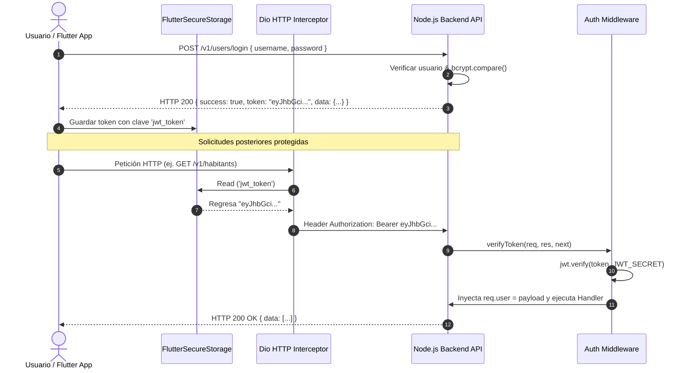
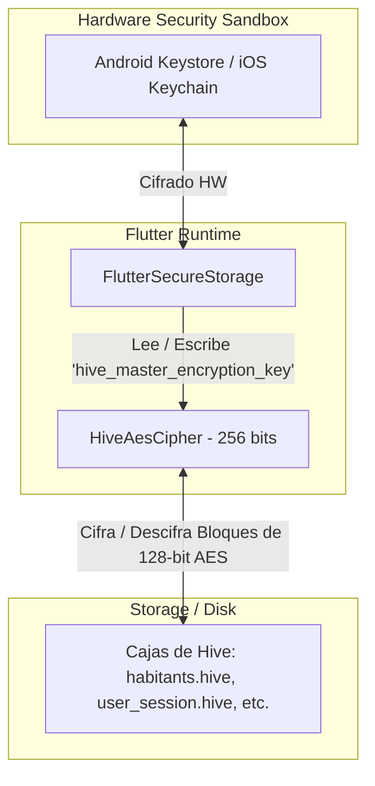
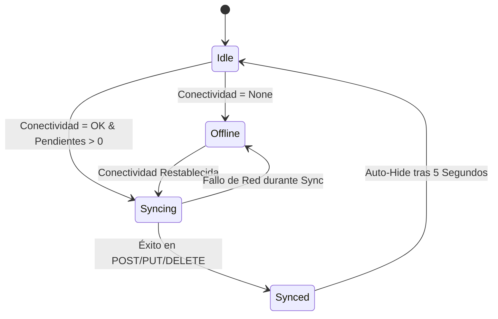

# 02 - PROTOCOLOS DE SEGURIDAD, RED Y CONEXIÓN

Este documento expone con precisión matemática y técnica cada uno de los protocolos de ciberseguridad, cifrado, comunicación de red, gestión de tokens y sincronización de datos implementados en Comuniapp.

---

## 1. PROTOCOLO DE AUTENTICACIÓN Y AUTORIZACIÓN (JWT + RBAC)

### 1.1 Estructura del Token JWT
El sistema utiliza **JSON Web Tokens (JWT)** bajo la especificación RFC 7519 para gestionar sesiones de usuario de forma sin estado (stateless).

* **Algoritmo de Firma**: HMAC utilizando SHA-256 (`HS256`).
* **Vigencia**: 7 días (`expiresIn: '7d'`).
* **Payload del Token**:
  ```json
  {
    "id": "usr_1774201200000",
    "username": "admin_comuna",
    "role": "admin",
    "iat": 1774201200,
    "exp": 1774806000
  }
  ```

### 1.2 Flujo de Emisión y Transmisión del Token



### 1.3 Control de Acceso Basado en Roles (RBAC - Role-Based Access Control)
El sistema soporta una jerarquía estricta de permisos mediante el middleware `authorizeRoles`:
* **`admin`**: Acceso total al sistema, gestión de usuarios, edición de padrón poblacional, censos, auditoría y estadísticas.
* **`vocero` / `operador`**: Permiso para crear y actualizar habitantes, denuncias y tomar encuestas de censos en campo.
* **`habitante`**: Acceso limitado a consulta de beneficios personales y envío de denuncias comunitarias.

---

## 2. PROTOCOLO DE CIFRADO DE DATOS EN REPOSO (DATA AT REST ENCRYPTION)

Para proteger la información personal sensible de la comunidad (cédulas, nombres, direcciones, condiciones socioeconómicas), se aplica cifrado militar **AES-256 (Advanced Encryption Standard)** a nivel de base de datos local Hive.



### 2.1 Mecanismo de Clave Maestra de Cifrado
En `lib/core/services/hive_config.dart`:
1. Al iniciar la app (`HiveConfig.init()`), la aplicación consulta a `FlutterSecureStorage` por la clave denominada `hive_master_encryption_key`.
2. Si no existe (primer inicio), `Hive.generateSecureKey()` genera una secuencia aleatoria criptográficamente segura de **32 bytes (256 bits)** basada en el generador de entropía del sistema operativo.
3. La clave se almacena inmediatamente en el Keystore/Keychain codificada en Base64URL.
4. Las 9 cajas de Hive (`userBox`, `habitantsBox`, `reportsBox`, `syncQueueBox`, `ayudasBox`, `censosBox`, `censoRecordsBox`, `auditoriaBox`, `eventosBox`) se abren obligatoriamente pasando la instancia `HiveAesCipher(encryptionKey)`.

---

## 3. PROTOCOLO DE RED Y CLIENTE API (`MongoDBService`)

El servicio `MongoDBService` (`lib/core/services/mongodb_service.dart`) actúa como el puente de red principal entre el cliente móvil y el backend remoto.

### 3.1 Estrategia Dinámica de URL Base
La URL del backend se resuelve dinámicamente según el entorno de ejecución:
```dart
static String get _defaultBaseUrl {
  const envUrl = String.fromEnvironment('API_BASE_URL');
  if (envUrl.isNotEmpty) return envUrl;

  if (kDebugMode) {
    return kIsWeb 
        ? 'http://localhost:3000/v1' 
        : 'http://10.0.2.2:3000/v1'; // Emulator loopback
  }
  return 'https://comuniapp-cmpr.onrender.com/v1';
}
```

### 3.2 Tolerancia a Arranques en Frío (Cold Starts)
Dado que el backend puede desplegarse en instancias Serverless o PaaS en nivel gratuito (como Render.com), las instancias inactivas pueden demorar hasta **30 segundos** en responder al primer request (Cold Start).
Por ello, la configuración de Dio establece:
```dart
connectTimeout: const Duration(seconds: 30),
receiveTimeout: const Duration(seconds: 30),
```

---

## 4. PROTOCOLO DE SINCRONIZACIÓN OFFLINE-FIRST (`SyncManager`)

El motor `SyncManager` (`lib/core/services/sync_manager.dart`) gestiona la convergencia eventual de datos entre el dispositivo local y el servidor central.



### 4.1 Ciclo de Ejecución de Sincronización
1. **Escucha de Conectividad**: `Connectivity().onConnectivityChanged` escucha cambios de estado físico de red.
2. **Fase Push (Local -> Remoto)**:
   - Identifica registros con `isSynced == false` en cada repositorio.
   - Ejecuta peticiones HTTP `POST` a `/v1/<collection>` enviando la representación JSON.
   - Si el servidor responde HTTP `200` o `201`, invoca `markAsSynced(id)` en el repositorio local.
3. **Fase Purga de Borrados**:
   - `_syncDeletedCensos()` consulta los IDs de formularios eliminados localmente en modo offline.
   - Ejecuta HTTP `DELETE /v1/censos/:id` y limpia la cola local de eliminaciones con `clearDeletedCensoId(id)`.
4. **Resolución de Conflictos**:
   - Prevalece la regla **LWW (Last-Write-Wins)** basada en la estampa de tiempo UTC `updatedAt`.

---

## 5. PROTOCOLO DE BASTIONADO Y DEFENSA EN PROFUNDIDAD DEL SERVIDOR (BACKEND HARDENING)

En `backend/src/index.js`, el servidor Express implementa 5 capas de protección activa:

### 5.1 Cabeceras de Seguridad HTTP (`helmet`)
Protege contra ataques de denegación por recursos cruzados y sniffing:
```javascript
app.use(helmet({
    crossOriginResourcePolicy: { policy: "cross-origin" }
}));
```

### 5.2 Limitación de Tasa (`express-rate-limit`)
Previene ataques DoS y fuerza bruta limitando a 200 peticiones por ventana de 15 minutos por IP:
```javascript
const apiLimiter = rateLimit({
    windowMs: 15 * 60 * 1000,
    max: 200,
    message: { success: false, error: 'Demasiadas solicitudes desde esta IP.' }
});
app.use('/v1/', apiLimiter);
```

### 5.3 Sanitización contra Inyecciones NoSQL (`express-mongo-sanitize`)
Limpia cualquier entrada que contenga símbolos reservador de MongoDB (`$` o `.`):
```javascript
app.use(mongoSanitize());
```

### 5.4 Hashing de Contraseñas (`bcryptjs`)
Las claves de los usuarios nunca se guardan en texto plano. Se procesan con un Salt aleatorio de 12 rondas:
```javascript
const salt = await bcrypt.genSalt(12);
const hashedPassword = await bcrypt.hash(password, salt);
```

### 5.5 Filtrado CORS (Cross-Origin Resource Sharing)
Restringe el acceso al API únicamente a los dominios explícitamente autorizados en la variable de entorno `ALLOWED_ORIGINS`.
